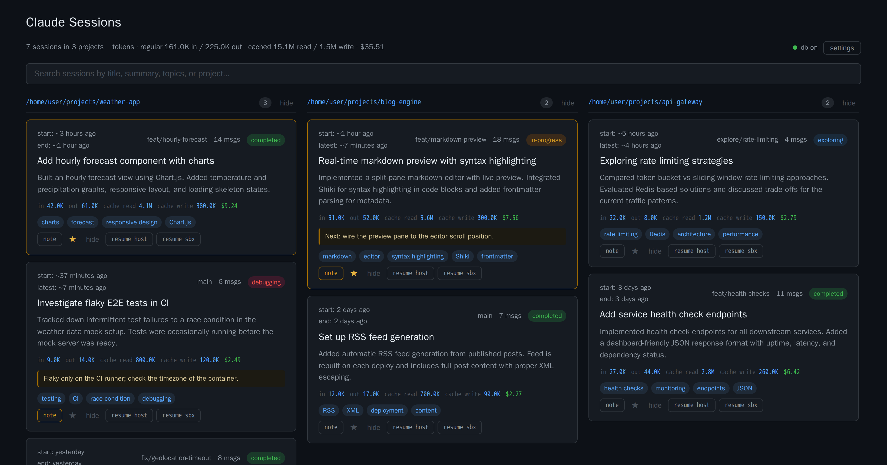

# Claude Session Tracker

Automatically tracks and summarizes Claude Code sessions using Claude (Sonnet by default, Haiku or Opus on request). Provides a web UI for browsing session history and generates per-project `SESSION_SUMMARIES.md` files for context in future conversations.



## Features

- **Automatic tracking** - Hooks fire on every response and session end
- **AI summaries** - Claude generates title, summary, topics, and status
- **Per-project summaries** - `SESSION_SUMMARIES.md` in each project directory for future session context
- **Web UI** - Search, filter, hide/restore sessions grouped by project
- **Resume commands** - One-click copy of `claude --resume <id>` commands
- **Session history skill** - Claude can read past session context via the plugin skill

## Requirements

- [Bun](https://bun.sh) 1.0+
- Claude Code CLI (uses your subscription via `claude -p` - no API credits consumed)

## Installation

Add the marketplace and install the plugin:

```
/plugin marketplace add maleta/claude-sessions
/plugin install session-tracker@claude-session-tracker
```

That's it. The plugin auto-registers its hooks and provisions the web UI on first run.

## How it works

### Hooks

- **Stop** - Fires after each Claude response. Analyzes after 1+ user messages, re-analyzes every 5 additional messages.
- **SessionEnd** - Fires when a session ends. Consolidates all incremental summaries into a final one.

### SESSION_SUMMARIES.md

After each analysis, the hook writes/updates a `SESSION_SUMMARIES.md` file in the project directory. This file contains:
- Session title and summary
- Date, branch, status, message count, topics
- Session ID and resume command

Future Claude sessions can read this file for context on past work (via the plugin's skill).

### Web UI

Static HTML file - no server needed, opens directly in the browser:

```bash
open ~/.claude/session-tracker/index.html
```

The web UI is auto-provisioned by the hook on first run. Features: search, project grouping, status badges, hide/restore, copy resume commands.

### Configuration

Pick the summary model for all projects with `sessionTracker.model` in `~/.claude/settings.json`. Accepted values are `sonnet` (default), `haiku` and `opus`; each always resolves to the latest model of that family.

```json
{
  "sessionTracker": {
    "model": "sonnet"
  }
}
```

Disable `SESSION_SUMMARIES.md` for a specific project by adding to `<project>/.claude/settings.local.json`:

```json
{
  "sessionTracker": {
    "summaryFile": false
  }
}
```

## Data flow

```
Hook fires (Stop/SessionEnd)
  |
  v  (count messages from transcript)
  |
  v  (check threshold: 1+ messages first time, then every 5 more)
  |
  v  (call the configured model via claude -p for summary)
  |
  v
~/.claude/session-tracker/sessions-data.js    <-- single source of truth
  |
  v  (also written per project)
  |
  v
<project>/SESSION_SUMMARIES.md                <-- per-project context
```

## Uninstall

Disable the plugin in Claude Code settings or remove it from `enabledPlugins` in `~/.claude/settings.json`.

To also remove session data:

```bash
rm -rf ~/.claude/session-tracker/
```

## License

MIT
